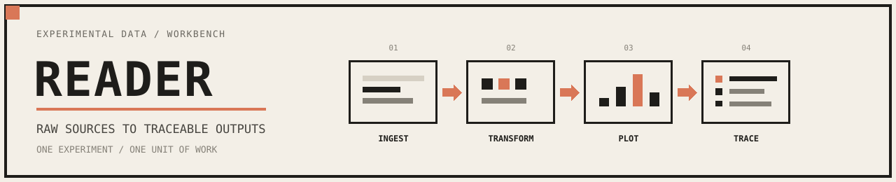

[](https://github.com/e-south/reader/actions/workflows/ci.yaml)
[](https://github.com/e-south/reader/actions/workflows/integration.yaml)
[](https://codecov.io/gh/e-south/reader)
[](https://www.python.org/downloads/release/python-3120/)



`reader` is a protocol-driven experimental workbench for structured assay data. It gives experiment authors one central YAML surface to declare assay inputs, analysis choices, and requested outputs, then compiles that authoring surface into a deterministic runtime plan that ingests raw data, applies transforms, emits traceable records, and materializes plots, exports, and notebooks.

It is meant to stay ergonomic for users and honest for maintainers. Users should be able to answer plain questions such as “what assay does this experiment use?”, “is this experiment blocked or ready to run?”, “is this a draft scaffold or an active experiment?”, “what gets ingested?”, “what transform chain runs?”, and “what plots or artifacts will be produced?” from the CLI and docs without reading compiler code or plugin internals. Maintainers should be able to add new assay families, ingest adapters, transforms, plots, and artifacts without turning the public YAML surface into a junk drawer.

The default UX is human-first: tables for normal use, JSON for automation and agent harnesses. Start with `uv run reader ls --details --readiness`, `uv run reader protocols`, `uv run reader inspect`, and `uv run reader explain`; the detailed contract shapes for discovery, readiness, inspection, validation, records, plots, and exports live in the docs index and CLI reference instead of being duplicated here.

---

## Documentation

- [Docs index](docs/README.md): authoritative route map for user, maintainer, and demo flows.
- [Architecture](ARCHITECTURE.md): top-level system map, ownership boundaries, registries, and invariants.
- [Design](DESIGN.md): product and information-design principles for `reader/v7`, protocols, and progressive disclosure.
- [Quality](QUALITY.md): quality bar, harness endpoints, evidence expectations, and failure taxonomy.
- [Reliability](RELIABILITY.md): preflight/run/verify contract, provenance expectations, and recovery model.
- [Security](SECURITY.md): trust boundaries, safe defaults, and extension-surface guidance.
- [CLI reference](docs/core/cli.md): discovery, inspection, validation, run, plot, export, notebook, and record commands.
- [Configuring reader/v7](docs/core/pipeline.md): the public YAML authoring surface and how protocols expose semantic inputs, analysis knobs, plot outputs, and export artifacts.
- [Retron sponge screen guide](docs/guides/retron_sponge_screen.md): matched-control sponge workflow, compiled metrics, default plot suite, and semantic-table exports.
- [Plugin development](docs/core/plugins.md): maintainer-facing guide for adding ingest, transform, plot, export, and validator plugins without leaking mechanics into user config.
- [Spec / architecture](docs/core/spec.md): deeper architecture notes and package layout.

## Quickstart

```bash
uv sync --locked --group dev --group notebooks
uv run pytest -q
uv run pytest -q -m smoke
uv run pytest -q -m repo_matrix
uv run pytest -q -m fleet
uv run pytest -q -m integration
uv run reader ls --root experiments
uv run reader ls --root experiments --details --format json
uv run reader ls --root experiments --details --readiness
uv run reader ls --root experiments --details --readiness --format json
uv run reader ls --root experiments --details --lifecycle draft
uv run reader ls --root experiments --details --protocol plate_reader/dual_reporter_screen
uv run reader ls --root experiments --details --protocol plate_reader/single_reporter_screen
uv run reader ls --root experiments --details --protocol plate_reader/retron_sponge_screen
uv run reader plugins --protocol plate_reader/dual_reporter_screen --category transform --format json
uv run reader plugins --protocol plate_reader/single_reporter_screen --category plot --format json
uv run reader plugins --protocol plate_reader/retron_sponge_screen --category transform --format json
uv run reader init ./experiments/20260317_new_assay --protocol <protocol-id>
uv run reader inspect experiments/template/config.yaml
uv run reader inspect experiments/template/config.yaml --format json
uv run reader config experiments/template/config.yaml --format json
uv run reader steps experiments/template/config.yaml --format json
uv run reader validate experiments/template/config.yaml --no-files --format json
uv run reader explain experiments/template/config.yaml --format json
uv run reader run experiments/template/config.yaml --dry-run --format json
uv run reader records experiments/template/config.yaml --format json
uv run reader protocols <protocol-id> --example-config
uv run reader protocols plate_reader/retron_sponge_screen --format json
uv run reader plot experiments/template/config.yaml --list --format json
uv run reader export experiments/template/config.yaml --list --format json
```

`uv run pytest -q` now keeps the default developer loop fast by excluding only the full data-backed `fleet` matrix. The default lane still runs the ordinary integration checks and the repo-wide config/metadata sweep. Use `uv run pytest -q -m repo_matrix` for the repo-wide config surface alone, `uv run pytest -q -m fleet` for the full active-experiment end-to-end matrix, `uv run pytest -q -m integration` when you intentionally want the whole integration surface, and `uv run pytest -q -m smoke` for only the representative runtime smoke slice.

Use `plate_reader/dual_reporter_screen` for CFP/YFP-style dual-reporter panels, `plate_reader/single_reporter_screen` for RFP-or-other single-reporter panels normalized to a configured denominator, and `plate_reader/retron_sponge_screen` when the assay contract depends on matched same-sensor controls, induced sponge effects, burden, leakiness, and cross-sensor ranking.

Use `experiment.lifecycle: draft` or `experiment.lifecycle: template` for intentionally non-runnable configs. Active experiments should omit `experiment.lifecycle` entirely.

## Workbench layout

```text
experiments/
  <experiment>/
    config.yaml
    inputs/
    notebooks/
    outputs/
```

Generated content belongs under `outputs/`. Fix the config or code and re-run the workflow instead of hand-editing generated artifacts.
